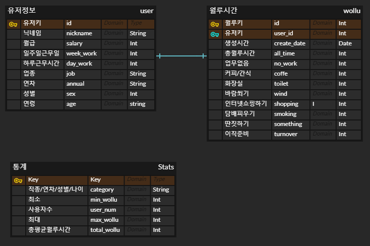
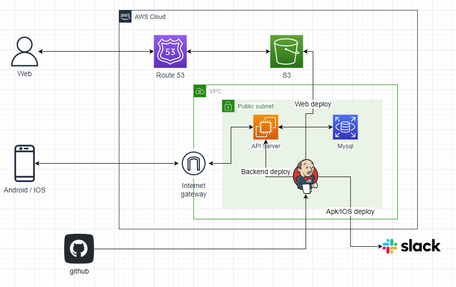
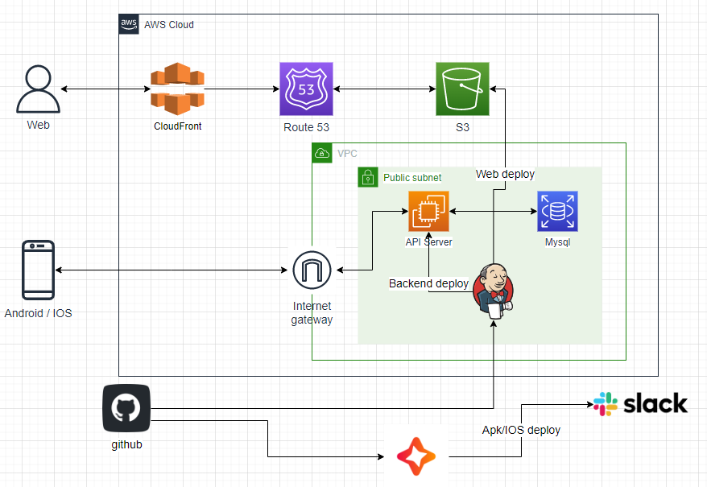

# Wollu

**자신이 하루동안 얼마나 월급 루팡을 하는지 체크할 수 있는 어플 및 웹**

## 멤버

- 장예훈 - Backend & CI/CD
- 김강직 - Frontend
- 김민형 - Android & IOS
- 정혜연 - Designer

## 프로젝트 선정 이유

- 일한 것에 비해 마땅한 보상을 받지 못하는 상황에서 조금이라도 보상을 받는다고 느끼기 위해
- 요즘은 SNS로 자신의 위치와 일정까지 공유하기 때문에 오늘 월루한 금액을 공유하며 흥미를 느끼기 위해
- 월급 루팡을 하는 가장 많이 하는 직급, 연령, 직업은 무엇일까

## 프로젝트 주요 기능

- 월별, 일별 월루 금액 체크
- SNS 공유
- 직무, 직급, 연령 등 루팡 통계

## DB 구조

- DB를 처음 쓴 프로젝트이기도 하고 최대한 간단하게 만들어 진행
- 유저 정보를 저장하는 테이블
- 유저들의 월루 금액을 일별로 저장하는 테이블
- 유저들의 직종/연차/성별/나이 별로 통계를 저장하는 테이블

## AWS 구성도

#### 초기 구성도

- 프로젝트 시작 시 만든 구성도이다.
- WEB은 서버와 통신이 필요없는 화면만 보여주는 static web이기 때문에 s3를 이용해 배포하고 route 53을 이용해 도메인을 연결했다.
- 구성도에는 백엔드 서버와와 jenkins 서버가 따로 있게 그려져 있지만 하나의 ec2에 port를 다르게 구성해 백엔드와 jenkins를 함께 배포한다.
- 백엔드 서버는 안드로이드와 IOS 유저가 요청을 보내면 해당 요청을 처리하고 디비와 연결을 담당한다.
- 디비는 mysql을 사용하고 ec2 서버와만 통신한다.
- jenkins는 github와 통신하며 push, pull request를 감지하여 동작한다.
- backend, web 브랜치 별로 다르게 구성하여 backend 브랜치에서 변경이 일어나면 ec2 서버에 반영하고 web 브랜치에서 변경이 일어나면 s3 서버에 반영한다.

#### 최종 구성도

- 처음 구상한 구성도에서 크게 2가지 부분 변경
- web의 도메인을 https로 변경하기 위해 cloudfront 추가
- flutter의 CI/CD 구축에 Jenkins가 어려워 좀 더 쉬운 codemagic을 이용하여 배포

